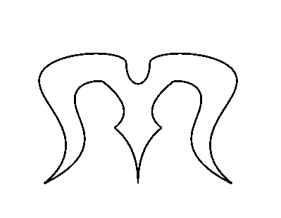
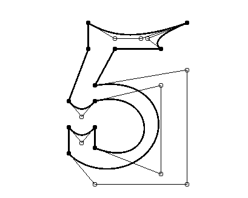

# Computational Geometry - Creativity with Bezier Curves

Font design using Bezier curves gives fonts greater scalability than designing them using a pixel map. Bezier curves are also used in the design of objects or characters in animated films precisely because they offer increased scalability.

The project consists in designing three figures using bezier curves:

1. A letter (upper or lower case) of a custom font.

<table>
  <tr>
    <td></td>
    <td></td>
  </tr>
</table>

2. A digit with special font.

<table>
  <tr>
    <td></td>
    <td></td>
  </tr>
</table>

3. A complex figure.

<table>
  <tr>
    <td></td>
    <td></td>
  </tr>
</table>
